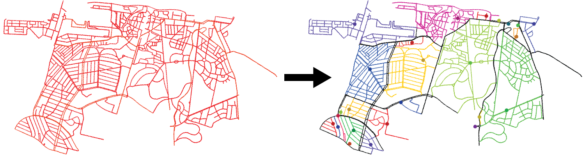

[](https://superblockify.city/)
[](https://pypi.org/project/superblockify/)
[](https://pypi.org/project/superblockify/)
[](https://github.com/PyCQA/pylint)
[](https://github.com/psf/black)
[](https://pypi.org/project/superblockify/)

[](https://joss.theoj.org/papers/87426e988ebd0a6d7f592eb16d1fd209)
[](https://doi.org/10.5281/zenodo.13300610)
[](https://github.com/NERDSITU/superblockify/actions/workflows/docs.yml)
[](https://github.com/NERDSITU/superblockify/actions/workflows/lint.yml)
[](https://github.com/NERDSITU/superblockify/actions/workflows/test.yml)
[](https://codecov.io/gh/NERDSITU/superblockify)

Source code to `superblockify` an urban street network

---

`superblockify` is a Python package for partitioning an urban street network into
Superblock-like neighborhoods and for visualizing and analyzing the partition results. A
Superblock is a set of adjacent urban blocks where vehicular through traffic is
prevented or pacified, giving priority to people walking and cycling.



## Installation

### Set up environment

Use [`conda`](https://docs.conda.io/projects/conda/en/latest/index.html)
or [`mamba`](https://mamba.readthedocs.io/en/latest/installation/mamba-installation.html)
or [`micromamba`](https://mamba.readthedocs.io/en/latest/installation/micromamba-installation.html)
to create the virtual environment `sb_env`:

```bash
conda create -n sb_env -c conda-forge superblockify
conda activate sb_env
```

> **Note:** While `pip` can install `superblockify`, it's not officially supported due
> to potential issues with C dependencies needed for OSMnx.
> If unsure, use `conda` as instructed above to avoid problems.

*Alternatively*, or if you run into
issues, [clone this repository](https://github.com/NERDSITU/superblockify/archive/refs/heads/main.zip)
and create the environment via
the [`environment.yml`](https://github.com/NERDSITU/superblockify/blob/main/environment.yml)
file:

```bash
conda env create --file environment.yml
conda activate sb_env
pip install superblockify
```

### Set up Jupyter kernel

If you want to use `superblockify` with its environment `sb_env` in Jupyter, run:

```bash
pip install --user ipykernel
python -m ipykernel install --user --name=sb_env
```

This allows you to run Jupyter with the kernel `sb_env` (Kernel > Change Kernel >
sb_env)

## Usage

We provide a minimum working example in two formats:

* [Jupyter notebook (`00-mwe.ipynb`)](https://github.com/NERDSITU/superblockify/blob/main/examples/00-mwe.ipynb)
* [Python script (`00-mwe.py`)](https://github.com/NERDSITU/superblockify/blob/main/examples/00-mwe.py)

For a guided start after installation, see
the [usage section](https://superblockify.city/usage/) in the documentation. See
the [`examples/`](https://github.com/NERDSITU/superblockify/blob/main/examples/) folder
for more example scripts.

## Documentation

Read the [documentation](https://superblockify.city) to learn more
about `superblockify`.

## Testing

The tests are specified using the `pytest` signature,
see [`tests/`](https://github.com/NERDSITU/superblockify/blob/main/tests/) folder, and
can be run using a test runner of choice.
A pipeline is set up,
see [`.github/workflows/test.yml`](https://github.com/NERDSITU/superblockify/blob/main/.github/workflows/test.yml).

## Credits & Funding

* Carlson M. Büth, [@cbueth](https://github.com/cbueth) (Implementation)
* Anastassia Vybornova, [@anastassiavybornova](https://github.com/anastassiavybornova)
  (Supervision)
* Michael Szell, [@mszell](https://github.com/mszell) (Concept)

Funded by the European
Union, [EU Horizon grant JUST STREETS](https://cordis.europa.eu/project/id/101104240)